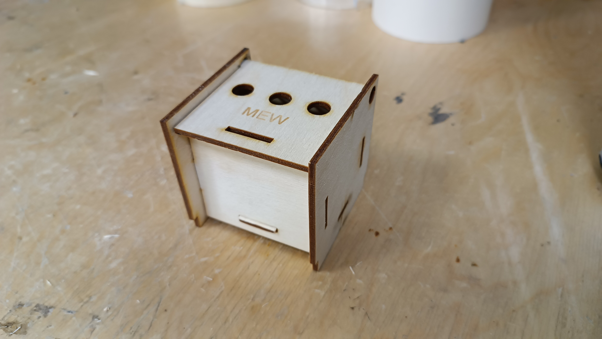
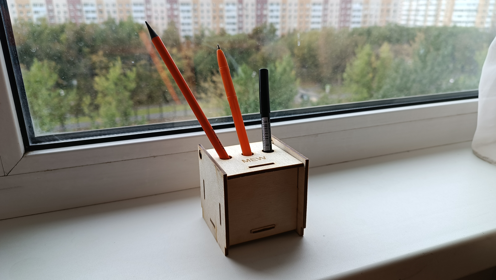

# Органайзер-1
**Освоение лазерной резки на примере изготовления шкатулки из листового материала**
-------------
*Оборудование - Лазерный гравер GCC Spirit GLS100*

*Программное обеспечение - CorelDraw*

*Чертеж - [Генератор](http://cy15505.tmweb.ru/)*

**План работы**
1. Задать параметры шкатулки, сгенерировать чертеж
2. Обработка чертежа в программе CorelDraw
3. Подготовка лазерно-гравировальной машины к работе
4. Лазерная резка деталей изделия и нанесение гравировки
5. Сборка деталей

Для изготовления одного органайзера был сгенерирован чертеж шкатулки с параметрами: 

высота = 7 см; ширина = 7 см; глубина = 5 см

Далее чертеж был подготовлен для печати в программе *CorelDraw* следующим образом:
- На крышке добавлены отверстия для карандашей диаметром 10 мм
- Линии для резки обозначались красным цветом с толщиной контура *сверхтонкий арбис*
- Символы для гравировки обозначались черным цветом. Для корректного отображения формат *шрифта* был на формат *кривые*

Перед запуском лезрного гравера была включена вытяжная система. В станок был помещен лист фанеры, прижатый металлической шайбой, для выравнивания поверхности относительно рабочей плоскости. Фокусировка лазерной картеки уже была настроена, поэтому следующем этапом была настройка печати и режимов гравировки.
Для красного цвета (резка) выбрана векторная графика *Vector*. Для черного цвета (гравировка) - растровая *Raster*

**Процесс лазерной резки фанерного листа**

https://github.com/Darya-Akhiyarova/Organizer-1/assets/144244924/c71e8a2c-d4be-47ab-906f-7705b0cd274a

Полученные детали были извлечены из станка и собраны вручную.

**Шкатулка после сборки**

